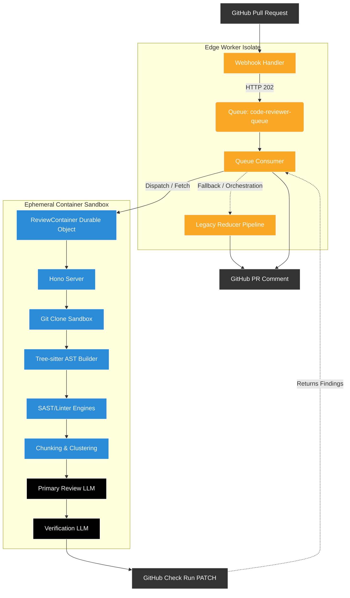

# System Architecture

The AI Code Reviewer represents an enterprise-grade agentic pipeline, running exclusively on Cloudflare's edge network. The architecture utilizes a **Dual-Compute Edge Model** to guarantee sub-second webhook ingestion while safely offloading extremely massive LLM review loads (heavy I/O + long cold starts) securely out-of-band.

## The Dual-Compute Pipeline

### 1. The Edge Worker Isolate (The Entrypoint)
The frontend of the application is a V8 Isolate running on Cloudflare Workers. It exposes a single `fetch` listener that hooks securely into GitHub Webhooks.
* **Responsibilities:**
  * Cryptographic HMAC-SHA256 signature verification.
  * JWT application token swapping.
  * Filtering irrelevant Git branches.
  * Synchronous instantiation of an "In Progress" GitHub Check Run.
  * Immediately pushing the payload to the Cloudflare Queue (Returning HTTP `202`).

### 2. The Cloudflare Container Sandbox (The Engine)
Because Cloudflare Workers crash on heavy OS-level binary operations, we utilize **Cloudflare Containers** via the `ReviewContainer` Durable Object. This boots up an ephemeral Sandbox capable of executing heavy binaries over a 15-minute timeframe.
* **Responsibilities:**
  * **OS Sandbox**: Clones the repository locally using actual `git`.
  * **Abstract Syntax Tree (AST)**: Recompiles code into Node structures using `tree-sitter`. Maps massive "blast radiuses" linking definitions and call expressions across the codebase.
  * **Static Security Tooling**: Executes `oxlint`, `biome`, and `semgrep` to intercept syntax faults with 100% mathematical consistency without expending LLM tokens.
  * **Multi-Agent Generation**: Maps chunks across Anthropic/OpenAI APIs, feeding them context heavily supplemented by AST definitions.

## Fault Tolerance & The Map-Reduce Fallback

To ensure the review pipeline achieves a 99.9% uptime SLA, the Edge Worker Consumer utilizes an intensive **Fallback Net**.

If the `ReviewContainer` sandbox crashes (e.g., Node.js OOM fatal errors, Cloudflare network partitions, or GitHub API clone failures):
1. The Container throws an HTTP `500` upwards asynchronously to the Queue Consumer.
2. The Queue Consumer instantly falls back to a simplistic **In-Worker Map-Reduce** pipeline.
3. The Fallback fetches raw diff patches from GitHub APIs instead of using Git, strips Out-of-Bounds Context, and performs a raw syntax string-matching review mapped against the LLMs.
4. No data drops occur.

## The Verification Agent (Hallucination Defense)

Instead of trusting the Primary Review LLM blindly, the Ephemeral Sandbox employs an internal **Adversarial Architecture**:
1. The `Review Agent` produces a set of code critiques.
2. The critiques are grouped alongside the localized diff patch and handed to the `Verification Agent`.
3. The Verification Agent's *sole purpose* is to act as a defense attorney. It mathematically proves whether the primary agent is hallucinating APIs, nitpicking useless syntax, or hallucinating data structures.
4. If a finding is deemed unhelpful or false, the Verification Agent silently assassinates the finding before it is pushed to the GitHub repository.
