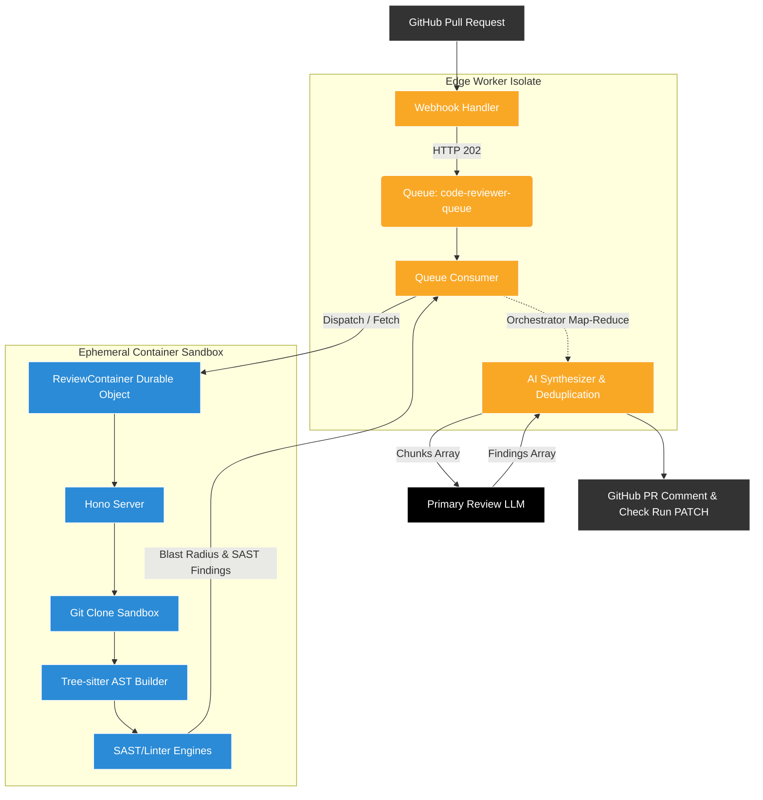

# System Architecture

The AI Code Reviewer represents an enterprise-grade agentic pipeline, running exclusively on Cloudflare's edge network. The architecture utilizes a **Dual-Compute Edge Model** to guarantee sub-second webhook ingestion while safely offloading extremely massive workloads securely out-of-band.

## The Dual-Compute Pipeline

### 1. The Edge Worker Isolate (The Entrypoint & Orchestrator)
The frontend of the application is a V8 Isolate running on Cloudflare Workers. It acts as both the Webhook ingester and the intensive Map-Reduce AI orchestrator.
* **Responsibilities:**
  * Cryptographic HMAC-SHA256 signature verification.
  * Synchronous instantiation of an "In Progress" GitHub Check Run.
  * Executing `.codereview.yml` filtering rules natively.
  * Splitting code PR diffs into chunk sizes respecting Cloudflare limits.
  * Map-Reduce asynchronous calling of Anthropic/OpenAI APIs.
  * Findings deduplication across LLM parallel chunks.

### 2. The Cloudflare Container Sandbox (The Engine)
Because Cloudflare Workers crash on heavy OS-level binary operations, we utilize **Cloudflare Containers** via the `ReviewContainer` Durable Object. This boots up an ephemeral Sandbox capable of executing heavy binaries to perform Static Security checks.
* **Responsibilities:**
  * **OS Sandbox**: Clones the repository locally using actual `git`.
  * **Abstract Syntax Tree (AST)**: Recompiles code into Node structures using `tree-sitter`. Maps massive "blast radiuses" linking definitions and call expressions across the codebase.
  * **Static Security Tooling**: Executes `oxlint`, `biome`, and `semgrep` to intercept syntax faults with 100% mathematical consistency without expending LLM tokens.

## Fallback Net Resilience

If the `ReviewContainer` sandbox crashes (e.g., Node.js OOM fatal errors, Cloudflare network partitions, or GitHub API clone failures):
1. The Container throws an HTTP `500` upwards asynchronously to the Queue Consumer.
2. The Queue Consumer instantly falls back to a simplistic **In-Worker Map-Reduce** pipeline, bypassing the deep AST container context.
3. The Fallback fetches raw diff patches from GitHub APIs instead of using Git, strips Out-of-Bounds Context, and performs a raw syntax string-matching review mapped against the LLMs.
4. No data drops occur, preserving the 99.9% uptime SLA.
